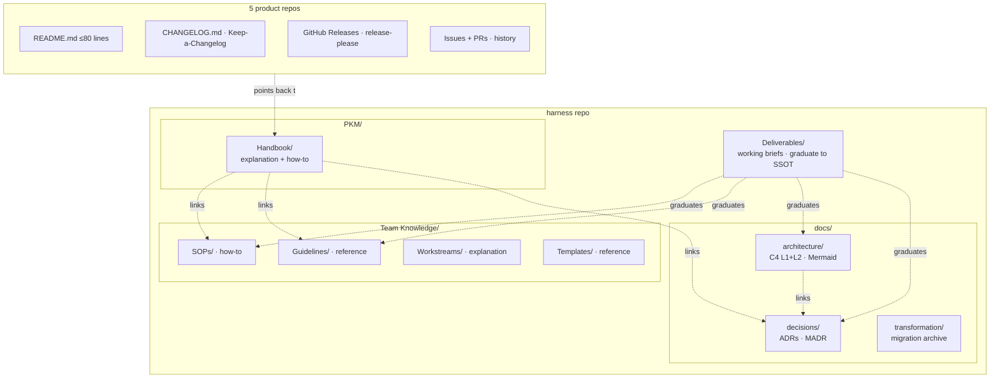
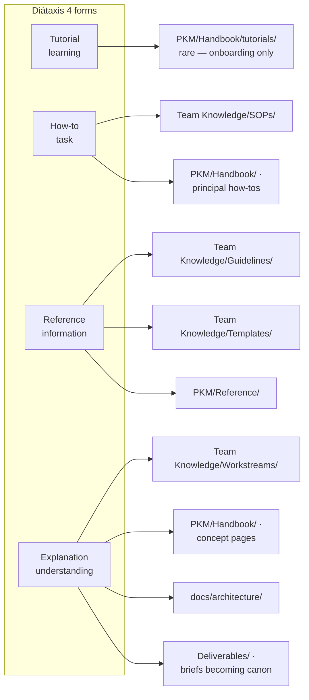
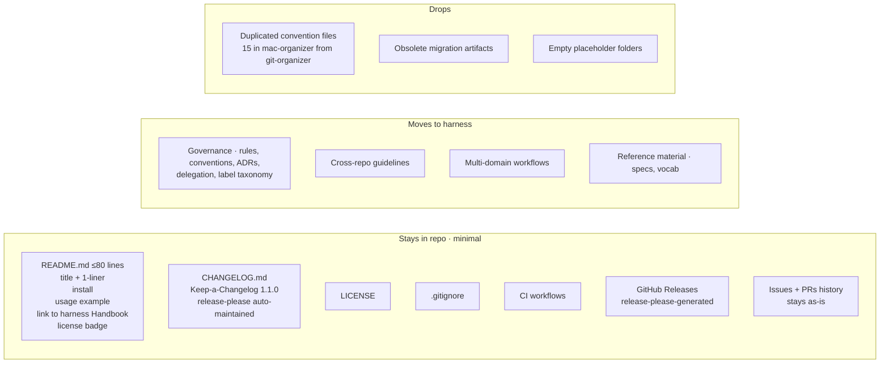

# Doc-System Plan

Synthesizes RECON's research into a concrete plan: framework choices, where each doc lives, how repo content migrates in, what minimally stays in the product repos, and how it's maintained.

> Principal preferences honored: visual > text, examples > prose, build during the process, verify accuracy.

---

## 1. Framework choices (locked unless you reshape)

| Concern | Choice | Why |
|---|---|---|
| Doc authoring discipline | **Diátaxis** — 4 forms (tutorial · how-to · reference · explanation), never mixed | Prevents "explano-tutorial" mush; broadly adopted; stable |
| Architecture diagrams | **C4 model**, L1 Context + L2 Container only | Adequate for personal infra; skip Component/Code |
| Diagram tool | **Mermaid** primary; D2 escape hatch for specific high-polish needs | Zero-config GitHub-native rendering |
| Decision log | **MADR 4.0.0, abbreviated** (drop RACI; keep Context + Considered Options + Decision + Pros/Cons) | Multi-option structured comparison, single-principal-friendly |
| Repo README | **Standard-Readme minimal** (≤80 lines: title + 1-liner + install + usage + pointer) | User/operator-facing; governance moves to harness |
| Repo CHANGELOG | **Keep-a-Changelog 1.1.0** + release-please automation | Standard format; automated from existing Conventional Commits |
| Repo versioning | **SemVer 2.0.0**; floor `0.y.z` until interface stable | Honest signal; release-please handles bumps |
| Commit discipline | **Conventional Commits 1.0.0** (already in use; confirmed current-spec) | No change needed |
| CI checks | **lychee** (links) + **mmdc** (Mermaid parse) + **freshness script** (front matter `last-verified`) | Lightweight; no doc generator |

---

## 2. Doc surfaces (visual)



---

## 3. Diátaxis mapping (the discipline)



**Rule:** every doc page is exactly ONE form. Codified as `GL-NNN-doc-authoring`. Front matter `form: tutorial | how-to | reference | explanation` enforced by CI. Mixed pages are split during the audit pass.

---

## 4. SSOT integration

- **New guideline** `GL-NNN-doc-authoring` — codifies the Diátaxis discipline + front-matter contract + Mermaid usage + ADR format.
- **Front matter contract** (LATTICE-authored): every `.md` under `Team Knowledge/`, `PKM/Handbook/`, `docs/architecture/`, `docs/decisions/`, `Deliverables/` declares `form:`, `status:`, `last-verified: YYYY-MM-DD`. Templates seeded.
- **Librarian-pass** (TOWER at session close, per `SOP-close-session`): form discipline, wikilink integrity, freshness flags.
- **Doc-drift audit** (SENTRY, weekly via CI): stale `last-verified` dates (> 180 days), broken links (lychee), unparsable diagrams (mmdc), ADR superseding chain integrity.

---

## 5. Migration approach (per `[[port-no-copy-paste]]` + `[[dont-rebuild-old-world]]`)

For each of the 5 product repos:

1. **Audit.** Inventory `docs/`, `README.md`, `CHANGELOG.md`, plus every `*.md` in the repo. Use the Phase-0-audit doc-related rows as starting inventory.
2. **Verdict per item** (intent-mining, not copy-paste):
   - **keep-as-is** — pure repo-usage content (install steps, repo-specific CLI flags). Rare.
   - **adapt-into-harness** — intent moves to a harness SSOT slot (SOP / Guideline / Workstream / Architecture / ADR); the dotclaude-style mechanic stays in repo if essential.
   - **merge** — collapse with similar content in harness or another repo.
   - **supersede** — harness equivalent already exists; drop and link to it from the repo if needed.
   - **drop** — obsolete or duplicated; no value in carrying.
3. **Author the harness destination** in the new framework (correct Diátaxis form, Mermaid where visual helps, MADR for decisions).
4. **Trim the repo** to the agreed minimum (§6 below).

QUILL leads the authoring; VAULT-mode TOWER runs the librarian pass; SENTRY audits before each repo's trim lands.

---

## 6. Repo-doc policy (the explicit ask)



**README template** (locked):

```markdown
# <repo-name>

> One-line description of what this repo is for.

## Install

```bash
# 1-3 copy-pasteable lines
```

## Usage

```bash
# minimal working example
```

## Docs

This repo is part of the [arechste/harness](https://github.com/arechste/harness) personal-infra system.
For operator context, the team model, and SOPs, see the [harness Handbook](https://github.com/arechste/harness/tree/main/PKM/Handbook).

## License

<badge>
```

**Issue/PR convention** (per `[[GL-001-commit-autonomy]]` already established):
- Title: `<type>(<scope>): <description>` (conventional commits).
- PR body: what + why + link to harness ADR or task. Lightweight template (no governance bloat).

---

## 7. CI integration

| Workflow | Trigger | Checks |
|---|---|---|
| `link-check` | push + weekly cron | lychee — broken markdown links across the repo |
| `diagram-parse` | push (PRs) | `mmdc` renders every `.mmd` and Mermaid block; fails on parse error |
| `doc-freshness` | weekly cron | reads front-matter `last-verified`; opens issue for files > 180 days stale |
| existing `wikilink-check` | push | extracts `[[name]]`, verifies file with stem exists |
| existing `validate.yml` | push | front-matter schema, JSON/YAML lint |

**Per product repo (post-migration):**
- `release-please` workflow on push to `main` — opens Release PR with CHANGELOG bump + version tag.
- Existing CI stays (validate, tests if any).

---

## 8. Maintenance (steady state)

- **QUILL writes** new doc content in the right Diátaxis form.
- **TOWER (librarian-pass)** runs every session close per `SOP-close-session`: form discipline, wikilink integrity, INDEX freshness.
- **SENTRY** audits weekly via CI: link health, diagram parse, doc-freshness, ADR superseding chains.
- **Every commit that changes structure** updates its diagram in the same commit (atomic, granular — the established pattern).

---

## 9. Open decisions — your call

| # | Decision | Recommendation | Trade-off |
|---|---|---|---|
| 1 | **Mermaid vs D2** for architecture diagrams | **Mermaid** + D2 escape hatch for specific high-polish needs | Zero GitHub-native friction vs. better visual polish at the cost of a build step |
| 2 | **SemVer floor** for product repos | `0.y.z` until interface stable | Honest "still moving" signal vs. `1.0.0` from day one |
| 3 | **ADR scope** | harness-only (`docs/decisions/`) | Cross-repo discoverability + reflects "harness governs, repos store artifacts" model vs. per-repo decision context |

---

## 10. Execution sequence (post-approval)

A. **Lock framework + decisions 1–3** (this plan ratified)
B. **Author `GL-NNN-doc-authoring`** — the Diátaxis discipline guideline
C. **Stand up architecture surface** — `docs/architecture/L1-context.md`, `L2-containers.md`, INDEX
D. **Author first ADR** — `docs/decisions/0001-doc-system.md` (this plan, as the founding decision in MADR form)
E. **Audit + retrofit existing Handbook + Deliverables** — add `form:` front matter, split mixed pages
F. **Wire CI** — lychee + mmdc + freshness script
G. **Per product repo** (one at a time, granular commits): audit → transform → migrate → trim README → enable release-please
H. **Steady state** — maintenance runs every session

Steps B–F happen in harness; G iterates per repo behind the freeze rules already in place.
