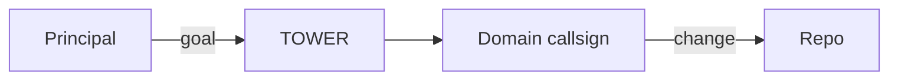

# Framework Explainer — what each choice is, what alternatives we weighed, and why we'd pick each for harness

Principal asked to learn the rationales before locking the doc-system plan. This is the explanation. Reading time ~15 minutes. Diagrams + ASCII + minimal prose; the full plan lives in `2026-05-30-doc-system-plan.md`.

---

## Group 1 — How docs are organized

### 1.1 Diátaxis — the authoring discipline

**What it is.** A documentation framework that says: every doc page serves *one* of four user needs, never mixed. Each form has rules.

| Form | What the reader is doing | What the page must do | What it must NOT do |
|---|---|---|---|
| **Tutorial** | Learning | Walk a beginner through doing the thing, with hand-holding | Be exhaustive; assume prior knowledge; skip steps |
| **How-to** | Achieving a task | Direct steps for someone who already knows what they want | Teach; explain why; over-context |
| **Reference** | Looking up facts | Exhaustive, accurate, scan-friendly, dry | Tell a story; persuade; tutorialize |
| **Explanation** | Understanding "why" | Discursive; concepts, history, trade-offs | Be action-oriented |

```
+---------------+-------------+
|    LEARNING   |    DOING    |
+---------------+-------------+
| Tutorial      | How-to      |   (action-oriented)
+---------------+-------------+
| Explanation   | Reference   |   (cognition-oriented)
+---------------+-------------+
   theoretical   practical
```

**Alternatives we weighed.**

| Alternative | Why we passed |
|---|---|
| No framework ("just write docs") | Causes "explano-tutorial mush": one page tries to teach + instruct + reference at once. Exactly the pattern in dotclaude's `home/rules/*.md`. |
| Microsoft / Apple style guides | Focus on *voice and tone*, not on *what kind of doc this is*. Solves a different problem. |
| 5-paragraph-essay rule (intro / 3 points / summary) | Rigid; doesn't capture procedural docs at all. |
| Read the Docs / Sphinx defaults | Tooling, not discipline. Open-ended; doesn't help an author choose the form. |
| Wikipedia-style "comprehensive article" | The format harness must explicitly avoid for SOPs and Guidelines. |

**Why for harness.** Splits clean to folders we already have: SOPs = how-to, Guidelines = reference, Workstreams = explanation, occasional Handbook tutorials for onboarding. Codify the discipline as `GL-NNN-doc-authoring` + front-matter `form:`. Forces split when a page bloats across forms. The dotclaude rules ate this lesson the hard way — they mix runtime mechanics (how-to) with principles (reference) with rationale (explanation) in the same file.

---

### 1.2 C4 model — architecture diagrams

**What it is.** A way to draw software/system architecture in four zoom levels, with one diagram per level. "C4" = the four C's, not "version 4."

```
                    +----------+
   Context     -->  | System   |   you + outside actors
                    +----------+
                         |
   Container   -->  +---+----+----+   apps + data stores inside
                    |        |       the system
                +---v----+   +-v----+
                |        |   |      |
   Component   -->  building blocks inside one container
   Code        -->  classes / functions
```

The author (Simon Brown) splits *diagramming* (boxes & lines) from *modelling* (a data structure that generates views). Lightweight use = diagrams only.

**Alternatives we weighed.**

| Alternative | Why we passed |
|---|---|
| **UML** | Full taxonomy (class / sequence / activity / state / deployment …). Powerful but high learning curve; designed for formal architecture teams. |
| **arc42** | 12-section template (Goals / Constraints / Context / Solution Strategy / …). Comprehensive — but designed for *enterprise stakeholder communication*. Over-engineered for personal infra. |
| **4+1 architectural view model** (Kruchten) | Academic; 5 distinct "views" (logical, process, physical, development, scenarios). Adds taxonomy we don't need. |
| **Ad-hoc box-and-line diagrams** | No methodology. Inconsistent across pages — every diagram reinvents its conventions. |

**Why for harness.** We only need Level 1 (Context — harness + your IT estate + outside systems) and Level 2 (Container — harness internals + product repos + adapters). Levels 3–4 (Component / Code) are over-detailed for a markdown-only orchestrator scaffold. arc42 had 12 sections of which 8 are wasted for our context. C4 gives shared vocabulary at exactly the right zoom.

---

### 1.3 MADR — Architectural Decision Records

**What it is.** A markdown format for capturing one decision per file. MADR = "Markdown ADR." Each ADR records *why* a choice was made so future-you doesn't re-litigate it.

```
docs/decisions/
  0001-doc-system.md          status: accepted
  0002-team-shape.md           status: proposed
  0003-pkm-rename.md           status: superseded by 0007
  ...
  0007-pkm-rename-redo.md      status: accepted, supersedes 0003
```

**MADR file shape (abbreviated for single-principal use):**

```markdown
# ADR-0007: PKM rename — align to myPKA scaffold

## Context and Problem Statement
We had Principal/ from round-0; principal asked to align with myPKA's PKM/.

## Considered Options
- A: Rename Principal/ → PKM/
- B: Keep Principal/, add PKM/ as alias
- C: Stay with Principal/

## Decision Outcome
Chose A. Mechanical rename, history preserved via git mv, R0-Q3 reversal
annotated in round-0.md.

## Pros and Cons of the Options
- A: + consistency with myPKA; − one-time wikilink update across 26 files
- B: + no rename pain; − two names for the same thing
- C: + zero work; − ongoing inconsistency with the principal's mental model

## Confirmation
Wikilink-check CI green after the rename commit; INDEX retitled.

Status: accepted, supersedes ADR-0003
```

**Alternatives we weighed.**

| Alternative | Why we passed |
|---|---|
| **Nygard's original** (2011): Title / Status / Context / Decision / Consequences | Minimal — but loses the option comparison, which is the main value for infra choices (e.g., "Mermaid vs D2"). |
| **No ADRs** | Decisions live in commit messages or chat. Lost the moment the chat scrolls off. |
| **Confluence / Notion** | Not in repo. Not versioned with the code that implements the decision. Drifts. |
| **One big `DECISIONS.md` log** | Not searchable. Hard to supersede (you'd append, never structure). |
| **YAML frontmatter only** | Too rigid; loses the prose context that future-you needs. |

**Why for harness.** Multi-option decisions are exactly what we hit constantly (Mermaid vs D2, SemVer floor, team shape). MADR's "Considered Options + Pros/Cons" forces the explicit weighing. Abbreviated (drop the RACI fields — irrelevant for single-principal). NNNN numbering + bidirectional supersede links + a hand-maintained `docs/decisions/INDEX.md` is enough; no `adr-tools` dependency.

---

## Group 2 — What each repo looks like

### 2.1 Standard-Readme minimal

**What it is.** A spec for what a README should contain, minimally. Title + 1-liner + Background (optional) + Install + Usage + API (if relevant) + Contributing + License. Aims to keep READMEs scannable and consistent across repos.

**Template** (the one we'll use for each product repo):

```markdown
# repo-name

> One-line description.

## Install

```bash
# 1-3 copy-pasteable lines
```

## Usage

```bash
# minimal working example
```

## Docs

This repo is part of [arechste/harness](https://github.com/arechste/harness).
For the team model, SOPs, and operator context see the
[harness Handbook](https://github.com/arechste/harness/tree/main/PKM/Handbook).

## License

<badge>
```

**Alternatives we weighed.**

| Alternative | Why we passed |
|---|---|
| **No spec** (current state) | Wildly inconsistent. Some READMEs are 5 lines, others are 500. |
| **"Awesome README" maximalism** (badges, gif demos, ToC, FAQ, contributors gallery, sponsorship …) | Visually rich but bloated; everything ends up in README. Slow to scan. |
| **GitHub Wiki** | Not versioned with code. Often abandoned. |
| **README as a small book** (governance + tutorial + reference all in one) | The pattern we're moving away from. |

**Why for harness.** Aligns with the operating-model decision: repos demote to artifact stores; governance moves to harness. Each repo's README answers ONE question: *how do I use this repo?* Everything else (the why, the team model, the SOPs) lives in harness — the README just points there.

---

### 2.2 Keep-a-Changelog 1.1.0

**What it is.** A spec for `CHANGELOG.md`. Six change categories. Latest version on top. `[Unreleased]` section at top tracks the next release.

```markdown
# Changelog

## [Unreleased]
### Added
- new feature being worked on

## [0.3.0] - 2026-05-30
### Added
- handbook seed pages
### Changed
- renamed Principal/ to PKM/
### Removed
- deprecated VAULT/RANGER/BRIDGE callsigns

## [0.2.0] - 2026-05-29
### Added
- autonomy-contract draft
- dotclaude domain intent brief
```

Six categories: Added / Changed / Deprecated / Removed / Fixed / Security.

**Alternatives we weighed.**

| Alternative | Why we passed |
|---|---|
| **No changelog** | Forces users to read commits or release notes scattered across GitHub. |
| **Git log dump** | Every commit, unfiltered. Noisy; commit messages aren't user-facing. |
| **Auto-generated from PR titles** (e.g., GitHub auto-release notes) | Misses context; mixes types in one flat list. |
| **GitHub Releases only** (no CHANGELOG.md) | Not in-repo. Not searchable from CLI. Tied to GitHub. |
| **git-cliff custom format** | Works, but reinvents what Keep-a-Changelog standardized. |
| **standard-version** | Deprecated as of 2024. |

**Why for harness.** Human-readable AND machine-automatable: `release-please` reads our existing Conventional Commits and writes the CHANGELOG entries + opens a Release PR for us. The six categories match how infra changes actually feel ("Added the new auth path; Removed the old one; Fixed the migration script").

---

### 2.3 SemVer 2.0.0 + the harness versioning discipline

**What it is.** Versions look like `MAJOR.MINOR.PATCH`. MAJOR = breaks consumers; MINOR = backward-compatible feature; PATCH = backward-compatible fix. Below `1.0.0`, anything goes ("anything may change at any time").

```
0.y.z   = under active development; "we may break things"
1.0.0   = the public API is committed; breaking changes need a major bump
2.0.0   = a deliberate breaking change has shipped
1.3.4   = 3rd feature batch since 1.0; 4th bug fix since that feature
```

**Alternatives we weighed.**

| Alternative | Why we passed |
|---|---|
| **CalVer** (e.g., `2026.05.30`) | Encodes *when* but says nothing about *compatibility*. Good for time-based releases (Ubuntu, JetBrains); wrong for libraries / configs with dependencies. |
| **PVP** (Package Versioning Policy, Haskell) | More granular; not mainstream outside Haskell. |
| **0ver / ZeroVer** ("always stay at 0.x") | A joke spec that hedges against ever declaring stability. Cute but not honest in the long run. |
| **No versioning** | Just rolling latest. Cross-repo dependencies can't pin anything. |

**Why for harness — including the discipline gap you flagged.** SemVer's value is the *compatibility signal* for cross-repo dependencies. The historical reality: the product repos never consistently practiced this — major bumps got skipped, dependencies between repos were never properly pinned, and "what does this version contain" was unclear. **The reset to `0.y.z` is genuine** (we are reshaping; nothing is stable yet) and gives us a clean slate to install the discipline harness-side.

The harness discipline to add (proposed as `GL-NNN-release-versioning`, to be authored once the framework ratifies):

```
- Each product repo declares its "public API" explicitly in README §Usage
  (e.g., dotfiles' public API = the env vars it exports + its bin/ scripts)
- Cross-repo dependencies are PINNED to a tagged version, never tracked as
  "latest main." Documented in harness/state/repo-baselines.yaml.
- Release-please bumps version from Conventional Commits:
    feat: → MINOR · fix: → PATCH · BREAKING CHANGE: → MAJOR
- A repo only declares 1.0.0 when its public API is committed for ≥1 quarter
  without breaking changes.
- CHANGELOG.md is the source of truth for "what changed"; GitHub Release notes
  mirror it.
```

This is the rigor that was missing. Harness is where it gets enforced.

---

### 2.4 Conventional Commits 1.0.0

**What it is.** Commit messages follow a structured format so tooling can parse them.

```
<type>(<optional scope>): <description>

[optional body]

[optional footer(s), e.g. BREAKING CHANGE: ...]
```

**Types** harness already uses (verified current-spec-compliant):

```
feat:     new feature           → MINOR bump
fix:      bug fix              → PATCH bump
refactor: code change, no behavior change
docs:     documentation only
chore:    maintenance, deps, build, no production code change
ci:       CI workflow changes
test:     test additions / changes
build:    build system changes
perf:     performance improvement
style:    formatting, whitespace
revert:   reverts a previous commit
```

Breaking changes: `feat!:` or `BREAKING CHANGE: ...` in footer → MAJOR bump.

**Alternatives we weighed.**

| Alternative | Why we passed |
|---|---|
| **Free-form** ("update", "fix stuff", "wip") | Unreadable history; no automation. |
| **Gitmoji** (✨ for feat, 🐛 for fix, etc.) | Emoji-driven; readable; but every tool wants text types, not emoji. |
| **Angular commit message** | Predecessor to Conventional Commits; CC is the modern successor. |
| **Issue-prefix only** (`[#42] add login`) | Tracks issue but not type or scope. Loses automation. |

**Why for harness.** Already in use (verified). Release-please needs it for automated CHANGELOG + version bumps. Zero migration cost — we just keep doing what we're doing.

---

## Group 3 — Tooling

### 3.1 Mermaid (+ ASCII + later diagrams.net / excalidraw)

**What it is.** Mermaid is a tiny DSL: you write text, GitHub renders a diagram. No build step.

```
flowchart LR
    A[Principal] -->|goal| B[TOWER]
    B --> C[Domain callsign]
    C -->|change| D[Repo]
```

Renders to:



Mermaid supports: flowcharts, sequence, state, ER, class, C4, mindmap, journey, gantt, pie, quadrant, timeline.

**Alternatives we weighed.**

| Alternative | What it's good for | Why we passed (or didn't) |
|---|---|---|
| **D2** (Terrastruct) | Cleaner syntax, better auto-layout (TALA engine) | Needs a build step; no native GitHub render. Keep as escape hatch if visual polish becomes a complaint. |
| **PlantUML** | Most mature for UML and formal C4 | Requires Java server or proxy; high friction for markdown-only. |
| **Graphviz / dot** | Low-level node placement; great for generated diagrams | Verbose for hand-authored; doesn't render natively on GitHub. |
| **ASCII** | Folder structures, simple boxes-and-arrows | **Keep — actively useful.** Zero tooling, renders anywhere, terse. Used in this very doc for folder layouts. Limit: bad above ~10 nodes or non-trivial layout. |
| **diagrams.net / drawio** | GUI; rich visual polish; exports SVG/PNG | Not diff-friendly. **Upgrade path — later, when richer visuals are warranted; export to `PKM/Images/`.** |
| **Excalidraw** | GUI; sketchy whiteboard aesthetic; collaborative | Not diff-friendly. **Same upgrade path — later, for whiteboard-style explainers.** |
| **PNGs / screenshots** | Pixel-perfect | Opaque to git diff; can't update without redrawing. |

**Why for harness.** Mermaid covers in-repo architecture / flow / sequence / C4 with zero tooling and renders everywhere we look at our own repo (GitHub PR, issue, raw markdown view, Obsidian if you use it, Notion if you ever embed). ASCII covers folder trees, simple state, and quick sketches. The richer GUI tools (diagrams.net, excalidraw) become useful once we have *content* that warrants polish — they'd ship as PNGs in `PKM/Images/` with the source file (`*.drawio` / `*.excalidraw`) committed alongside.

---

### 3.2 CI stack — lychee + mmdc + freshness

**What each does.**

| Tool | What it checks | When it runs |
|---|---|---|
| **lychee** (lycheeverse/lychee-action) | Broken markdown links — internal and external | push + weekly cron |
| **mmdc** (@mermaid-js/mermaid-cli) | Mermaid blocks parse and render without error | push (PRs) |
| **freshness script** | YAML front-matter `last-verified` dates; opens an issue for files stale > 180 days | weekly cron |
| existing **wikilink-check** | `[[name]]` references resolve to a real file under `Team/`, `Team Knowledge/`, `PKM/`, `docs/` | push |
| existing **validate.yml** | Front-matter schema, JSON/YAML lint | push |

**Alternatives we weighed.**

| Alternative | Why we passed |
|---|---|
| **No CI on docs** | Docs rot silently; broken links accumulate; stale guidance misleads. |
| **markdown-link-check** | Older link checker; slower; less feature-rich than lychee. |
| **html-proofer** | Works on rendered HTML; more setup; aimed at static-site generators. |
| **mkdocs / sphinx / docusaurus + their built-in checks** | Pulls in a doc generator we don't need. Adds build complexity for a markdown-only repo. |

**Why for harness.** Light. GitHub-native. Catches the specific failure modes that hurt docs most. No doc generator: GitHub renders markdown (including Mermaid) for free.

---

## What's still genuinely open (with my lean)

1. **Mermaid vs D2** — *settled by your message:* Mermaid + ASCII primary; diagrams.net/excalidraw as later upgrade path. D2 not needed.
2. **SemVer floor** — *settled:* `0.y.z`. Plus the harness discipline (GL-NNN-release-versioning) you flagged the need for.
3. **ADR scope** — *settled:* harness-only `docs/decisions/`; harness owns the spec/design authority over the repos.

So the open list collapses to zero — the plan is fully specified.

---

## Where this explainer goes next

This file is a Diátaxis "explanation" — it teaches the rationale, doesn't tutor or instruct. Once ratified, it graduates to `PKM/Handbook/07-framework-rationale.md` as the principal-facing reference for the doc framework. The execution sequence (A–H in the plan) can then start: author `GL-NNN-doc-authoring`, stand up `docs/architecture/` L1+L2, write ADR-0001 (the doc-system decision), and begin the per-repo migration.

> Reading this through, ask: anything I left unclear or got wrong about your context?
