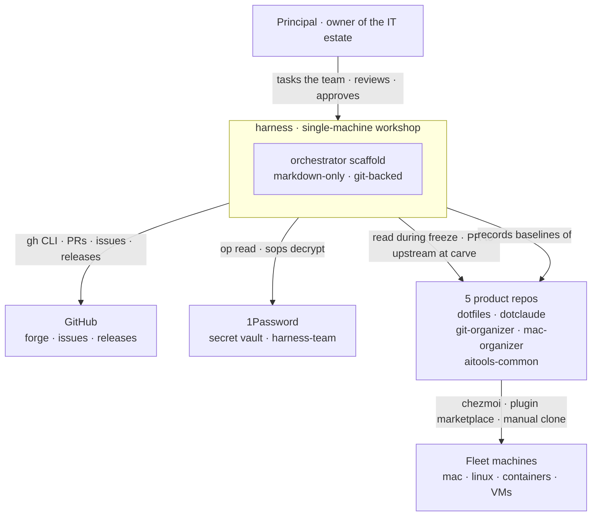

# L1 — System Context

Where harness sits and who/what it talks to. The big picture before any internals.

## What harness is

A **single-machine, markdown-only orchestrator scaffold** living at `~/airepos/common/harness/`. One machine at a time (today merktnix; primary moves to fragtnix). Content is git-backed; the workshop isn't chezmoi-distributed.

## Actors and external systems

| | Role | Interaction with harness |
|---|---|---|
| **Principal** | Owner of the IT estate; commander to TOWER's commander-of-team | Tasks the team via TOWER; reviews/approves; grants autonomy via `[[autonomy-contract]]`; reads the Handbook |
| **GitHub** | Forge — hosts harness + the 5 product repos; mirror for tasks that become PRs | harness writes via `gh` CLI (PRs, issues, releases) · reads via `gh api` |
| **1Password** | Canonical secret vault (`harness-team`); age-key bridge per `[[GL-002-credential-custody]]` | harness reads via `op read`; never writes |
| **5 product repos** | Artifact stores — dotfiles, dotclaude, git-organizer, mac-organizer, aitools-common | harness reads (clones live under `repos/`, gitignored, read-only during Phase-2 freeze); writes to upstream via PR at Phase-5a carve |
| **Fleet machines** | Mac/Linux/containers/VMs that consume what the product repos distribute | Receives via chezmoi (dotfiles, dotclaude), plugin marketplace (aitools-common), manual clone (organizers); harness does **not** push to fleet directly |

## Boundaries

- harness writes to: itself; GitHub (via `gh`); state (delegations, inventory, baselines).
- harness does **not** write to: the local `repos/` clones; the fleet directly; the 1Password vault.
- Distribution to the fleet always goes *through* the product repos' established mechanisms, not from harness.

## Why this matters

Two structural properties protect against blast-radius mistakes:
- **Single-machine** — losing the workshop means re-cloning from GitHub; no cross-machine state to reconcile.
- **Repos-as-bridge** — fleet machines never trust harness directly; they trust the product repos, which trust signed merges to `main`.

## Next level

[[L2-containers]] shows what's inside the harness box.
