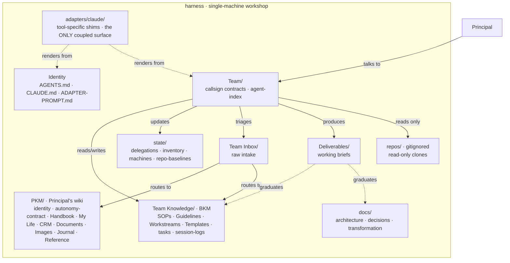

# L2 — Container View

Inside harness: how the scaffold is structured.



## Containers

| Container | Form | Purpose | Primary owner(s) |
|---|---|---|---|
| **Identity** (`AGENTS.md`, `CLAUDE.md`, `ADAPTER-PROMPT.md`) | Bootstrap | Tool-agnostic identity contract — first read every session | TOWER |
| **Team/** | Contracts | 13 callsign contracts + `agent-index.md` routing table | TOWER · SCOUT |
| **Team Knowledge/** (the BKM) | SSOT | SOPs (how-to) · Guidelines (reference) · Workstreams (explanation) · Templates · tasks · session-logs | QUILL · LATTICE · all callsigns |
| **PKM/** | Principal's wiki | `.user.yaml` · About-me · Goals · autonomy-contract · Handbook · My Life · CRM · Documents · Images · Journal · Reference · Machines | principal (owns); QUILL writes |
| **Team Inbox/** | Intake | Raw items dropped by the principal — triaged + filed per `[[SOP-process-inbox]]` | TOWER triage + TOWER (librarian-mode) capture |
| **Deliverables/** | Working surface | Time-stamped briefs, proposals, research — graduate to SSOT once ratified | originating callsign |
| **state/** | Operational | delegations, inventory, machines, `repo-baselines.yaml`, credentials | CASCADE · FORGE |
| **docs/** | System docs | `architecture/` (this) · `decisions/` (ADRs) · `transformation/` (migration archive) | QUILL |
| **adapters/claude/** | Tool shims | Subagent shims · command shims · hooks · settings — **the only tool-coupled surface** | RELAY |
| **repos/** | External clones | Gitignored read-only clones of the 5 product repos | (read-only) |

## How they connect

- **Principal → Team:** all interaction goes through TOWER, which pulls in the right callsign.
- **Team → SSOT/state:** callsigns read SSOT (which procedures and rules apply) and write state (what they did, baselines, inventory).
- **Inbox → PKM/SSOT:** TOWER triages, TOWER (librarian-mode) captures into the right destination, original is removed.
- **Deliverables → SSOT/docs:** briefs and proposals graduate to Guidelines / Workstreams / ADRs / Handbook once principal-ratified.
- **Adapter ← Identity + Team:** RELAY's job is to render the agnostic content into Claude-readable shims. The adapter is *generated*, not authored.
- **Team → repos (read-only):** clones live under `repos/` for cross-repo inspection during the Phase-2 freeze; writes go to upstream via PR, never to the local clone.

## Tool-agnosticism, visualized

```
+-------------------- harness ---------------------+
| Identity · Team · SSOT · PKM · state · docs ·    |  ← all tool-agnostic
| Team Inbox · Deliverables · repos                |
+--------------------------------------------------+
                       ↓ rendered into ↓
+--------------------------------------------------+
| adapters/claude/    (tool-specific surface)      |  ← only Claude touches this
+--------------------------------------------------+
                       ↓ loaded by ↓
+--------------------------------------------------+
| Claude Code runtime · subagents · hooks          |
+--------------------------------------------------+
```

If we add Cursor, `adapters/cursor/` lands as a peer of `adapters/claude/` — **nothing else in harness changes**. The agnostic core is the contract; adapters are the renderers.

## See also

- [[L1-context]] — harness in the wider IT estate
- [[ADR-0001-doc-system]] — the founding decision behind the doc surfaces
- `Deliverables/2026-05-29-phase-2-operating-model.md` — the operating model that locked this shape
- `[[GL-003-doc-authoring]]` — the discipline each container follows
